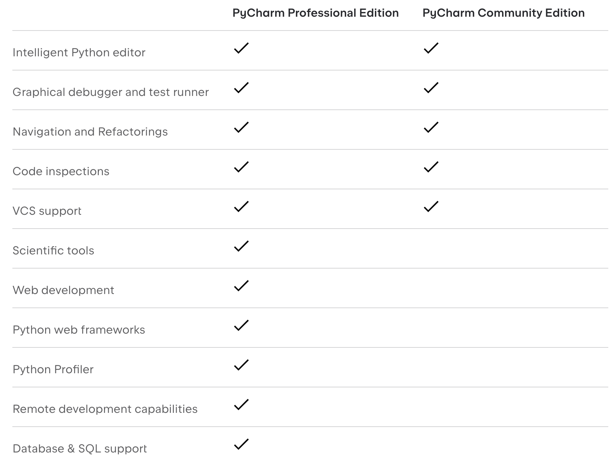
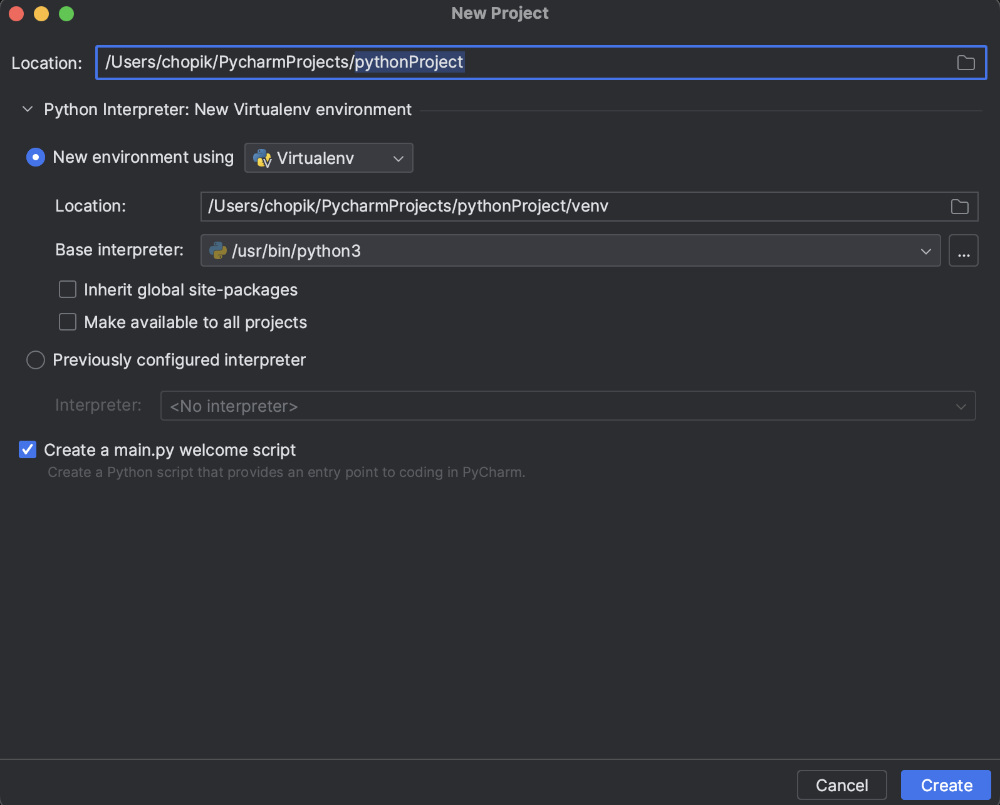
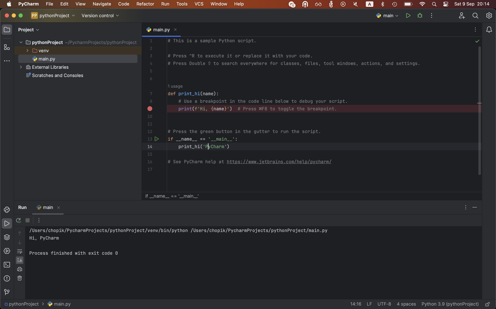

# JetBrains PyCharm Community

## Установка

Вообще есть две версии PyCharm: Professional Edition и Community Edition. Вот различия:

На текущем этапе, как правило, достаточно PyCharm Community Edition; его можно скачать по ссылке: https://www.jetbrains.com/pycharm/download. При необходимости можно оформить лицензию на Professional Edition по корпоративной почте (возможно уже нельзя): https://www.jetbrains.com/community/education/#classrooms. Дистрибутив Professional Edition доступен на той же странице загрузки: https://www.jetbrains.com/pycharm/download.

Для пользователей macOS важно выбрать дистрибутив, соответствующий вашему процессору:
- Apple Silicon (M1/M2/M3) — сборка “Apple Silicon” / ARM64 (arm64).
- Intel — сборка “Intel” / x64 (x86_64).

Как проверить процессор:
- Apple Menu → About This Mac → Chip/Processor.
- Или в терминале: `uname -m` (arm64 — Apple Silicon, x86_64 — Intel).

## После установки

ППосле установки откройте PyCharm. На первом запуске выберите пункт «Do not import settings» (скорее всего, переносить настройки не из чего).

Создание проекта:
1) Нажмите «New Project».
2) Укажите путь и имя проекта.
3) В разделе «Python Interpreter» выберите «New virtual environment (venv)»:
   - Location: по умолчанию в папке проекта (например, `.venv`);
   - Base interpreter: путь к установленному Python 3.x.
4) Нажмите «Create».

Примечание: venv — это виртуальное окружение (изолированный интерпретатор и зависимости проекта). Подробнее: https://docs.python.org/3/library/venv.html#module-venv

Все готово. Теперь можно создавать файлы и запускать их.

Создание файла:
- В панели Project щёлкните правой кнопкой по названию проекта (например, `pythonProject`) -> New -> File.
- Укажите имя файла (например, `main.py`) и нажмите Enter.

Запуск:
- Откройте файл и нажмите зелёную кнопку запуска (▶️), или кликните правой кнопкой по файлу -> Run 'main'.
- Убедитесь, что рядом с кнопкой запуска выбрана нужная конфигурация/имя файла.

